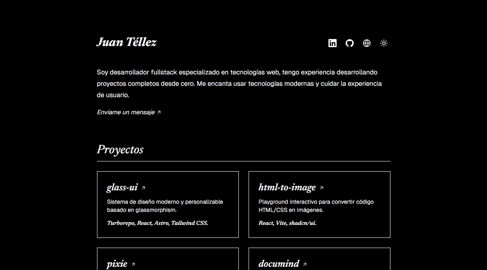

<div align="center">

# jntellez.dev

<a href="https://jntellez.dev">
  
</a>

My personal website - fullstack developer specializing in web technologies.

[Visit site](https://jntellez.dev/en) • [Versión en español](https://jntellez.dev)

</div>

## Stack

- **Framework** — [Astro](https://astro.build)
- **Language** — [TypeScript](https://www.typescriptlang.org)
- **Styling** — [Tailwind CSS](https://tailwindcss.com)
- **Icons** — [astro-icon](https://github.com/natemoo-re/astro-icon)
- **i18n** — Spanish / English

## Getting Started

1. Clone the repository:

```bash
git clone https://github.com/jntellez/jntellez.dev.git
cd jntellez.dev
```

2. Install dependencies:

```bash
pnpm install
```

3. Start the development server:

```bash
pnpm dev
```

4. Open [http://localhost:4321](http://localhost:4321) in your browser.

## License

[Apache 2.0](LICENSE)
